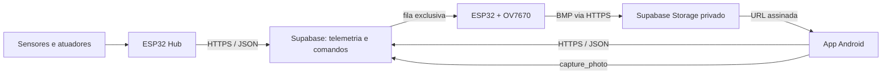
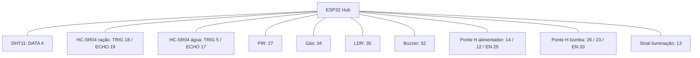

# Lauro Andrade - Pet Guardian IoT

Sistema IoT para monitoramento e cuidado remoto de pets. O projeto integra sensores,
atuadores, câmera OV7670 sem FIFO, aplicativo Android e backend Supabase.

## Problema e solução

Quando o tutor está fora de casa, pode não perceber rapidamente falta de água ou ração,
alterações ambientais, presença no local ou falhas dos dispositivos. O Pet Guardian
centraliza essas informações e permite acompanhar e controlar o ambiente pelo celular.

O sistema usa duas placas independentes:

- **ESP32 Hub:** mede o ambiente e controla bomba, alimentador e iluminação.
- **ESP32 + OV7670:** captura fotos e envia diretamente ao Supabase, sem passar pelo hub.

## Funcionalidades

- Temperatura e umidade com DHT11.
- Nível de ração calculado para recipiente de **10 cm**.
- Nível de água calculado para recipiente de **14 cm**.
- Detecção de presença, luminosidade e gás.
- Controle de bomba, motor do alimentador e iluminação.
- Melodia no buzzer após conexão Wi-Fi e tentativa de reconexão.
- Solicitação remota de fotos e upload para bucket privado.
- Álbuns, favoritos, compartilhamento e salvamento na galeria Android.
- Linha do tempo, comparação diária, limpeza configurável e notificações Android.

## Arquitetura



## Componentes

| Componente | Especificação / função |
|---|---|
| 2x ESP32 DevKit | Hub de sensores e nó dedicado da câmera |
| OV7670 sem FIFO | Câmera RGB565 ligada ao barramento paralelo |
| DHT11 | Temperatura e umidade |
| 2x HC-SR04 | Nível de ração e água |
| Sensor PIR | Detecção de presença |
| Sensor de gás analógico | Alerta do ambiente |
| LDR | Detecção de luminosidade |
| Ponte H | Acionamento do motor e bomba |
| Motor DC | Liberação de ração |
| Bomba d'água | Controle de água |
| Buzzer | Feedback sonoro |
| Fonte externa adequada | Alimentação de motores, bomba e placas |

> Motores e bomba não devem ser alimentados diretamente pelos pinos da ESP32. Utilize
> ponte H, fonte compatível e GND compartilhado.

## Esquema de ligação

O esquema detalhado, incluindo alimentação, proteção elétrica e as duas placas, está
em [docs/ESQUEMA_ELETRICO_COMPLETO.md](docs/ESQUEMA_ELETRICO_COMPLETO.md). A pinagem
também pode ser consultada no projeto [Wokwi](wokwi/diagram.json), que abstrai os
componentes não disponíveis no simulador sem alterar o código.

### Hub de sensores



### ESP32 com OV7670 sem FIFO

| Sinal OV7670 | GPIO ESP32 |
|---|---:|
| SIOD / SDA | 21 |
| SIOC / SCL | 22 |
| VSYNC | 34 |
| HREF | 35 |
| XCLK | 32 |
| PCLK | 33 |
| D0, D1, D2, D3 | 27, 5, 2, 15 |
| D4, D5, D6, D7 | 14, 13, 12, 4 |
| RESET | 3,3 V |
| PWDN | GND |

## Protocolo de comunicação

O projeto utiliza **Wi-Fi com HTTPS e JSON**, pois permite comunicação remota,
integração com Supabase e proteção dos tokens durante o transporte.

- Telemetria e comandos usam JSON, formato legível e fácil de depurar.
- Fotos usam BMP binário, simples de gerar na ESP32 sem FIFO.
- O bucket de fotos é privado e o app recebe URLs assinadas temporárias.
- Hub e câmera usam filas separadas para não consumirem comandos um do outro.

## Estrutura do repositório

```text
android_pet_guardian_app/          aplicativo Android em Kotlin
cloud/dashboard/                   dashboard web/PWA
cloud/supabase/                    schema e Edge Functions
docs/                              artigo técnico e esquema elétrico completo
src/esp32_pet_hub_dual/            firmware do hub
src/esp32_ov7670_non_fifo_node/    firmware e biblioteca da OV7670
wokwi/                             diagrama de pinagem para simulação
```

## Artigo e guia de reprodução

O documento [docs/ARTIGO_TECNICO.md](docs/ARTIGO_TECNICO.md) apresenta problema,
objetivos, arquitetura, materiais, montagem, protocolos, instalação, testes e
limitações. Ele foi escrito como artigo técnico e guia para reproduzir o projeto
completo.

Os esquemas visuais usados na documentacao ficam em [docs/assets](docs/assets). Slides
nao sao obrigatorios pela orientacao da disciplina; o roteiro tecnico principal esta
mantido em Markdown para facilitar revisao pelo GitHub.

## Instalação

### 1. Supabase

1. Crie um projeto Supabase.
2. Execute `cloud/supabase/schema.sql`.
3. Publique as funções em `cloud/supabase/functions/`.
4. Cadastre um dispositivo e guarde `token` e `dashboard_token`.
5. Consulte [cloud/README_CLOUD_ARCHITECTURE.md](cloud/README_CLOUD_ARCHITECTURE.md).

### 2. Hub de sensores

1. Abra `src/esp32_pet_hub_dual/esp32_pet_hub_dual.ino`.
2. Configure Wi-Fi e, se desejar sincronização, habilite `CLOUD_SYNC_ENABLED`.
3. Instale a biblioteca **DHT sensor library**.
4. Selecione **ESP32 Dev Module** e grave a placa.

### 3. Nó OV7670

1. Abra `src/esp32_ov7670_non_fifo_node/esp32_ov7670_non_fifo_node.ino`.
2. Configure Wi-Fi, `CLOUD_DEVICE_TOKEN` e URLs do Supabase.
3. Mantenha os arquivos `.h` e `.cpp` dessa pasta junto ao sketch.
4. Grave usando velocidade `115200` se `921600` ficar instável.
5. No Monitor Serial, confirme `VSYNC: OK` e `Rotas prontas`.

A resolução enviada à nuvem é `80x60`, com imagem útil de `72x49`. Essa escolha mantém
memória suficiente para os buffers HTTPS em uma ESP32 sem PSRAM.

### 4. Aplicativo Android

1. Configure `android_pet_guardian_app/app/src/main/java/com/lauro/petguardian/AppConfig.kt`.
2. Abra `android_pet_guardian_app` no Android Studio ou execute:

```bash
cd android_pet_guardian_app
./gradlew assembleDebug
```

3. Instale o APK como atualização para preservar fotos e dados locais.

## Como usar

1. Ligue o hub e a câmera.
2. Aguarde a conexão Wi-Fi e confira o Monitor Serial.
3. Abra o aplicativo e acompanhe os indicadores.
4. Use **Controles** para acionar alimentador, bomba e iluminação.
5. Em **Fotos**, toque em **Solicitar foto da câmera**.
6. A OV7670 consulta a fila, captura, envia ao Supabase e o app baixa a imagem.

## Segurança

- Não publique senhas Wi-Fi, `device_token`, `dashboard_token` ou `service_role`.
- Os valores presentes neste repositório são exemplos.
- O `service_role` existe somente nas variáveis protegidas das Edge Functions.
- O bucket `pet-photos` é privado.

## Validação realizada

- App Android compilado e instalado em Samsung S24 Ultra.
- Firmware do hub compilado.
- Firmware OV7670 compilado e gravado em ESP32-D0WD-V3.
- Captura local por `/capture.bmp`.
- Fluxo remoto validado: app → comando → OV7670 → Supabase → app.
- Fotos BMP reais recebidas no aplicativo.

## Autor

**Lauro Andrade** - projeto acadêmico e portfólio técnico de IoT.
