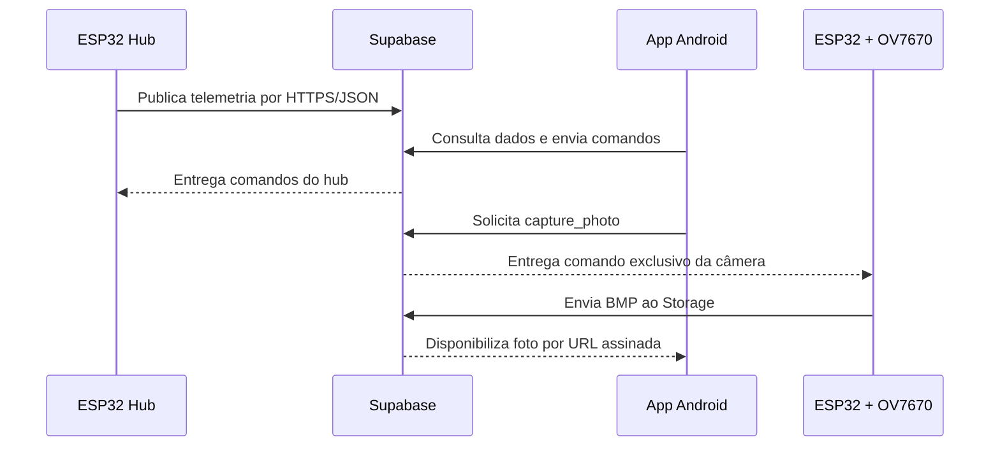

# Pet Guardian IoT: sistema de monitoramento e cuidado remoto de animais

**Autor:** Lauro Andrade  
**Área:** Internet das Coisas, sistemas embarcados e aplicativos móveis

## Resumo

Este artigo apresenta a construção do Pet Guardian IoT, um sistema que permite
monitorar o ambiente de um animal doméstico, acompanhar água e ração, detectar
presença, acionar dispositivos e solicitar fotografias remotamente. A solução utiliza
duas placas ESP32: um hub de sensores e atuadores e um nó dedicado à câmera OV7670 sem
FIFO. Os dados e comandos são transportados por Wi-Fi, HTTPS e JSON usando Supabase,
enquanto um aplicativo Android oferece visualização e controle. O documento descreve
componentes, ligações, arquitetura, instalação, configuração, testes e limitações para
que o projeto possa ser reproduzido.

**Palavras-chave:** IoT; ESP32; OV7670; Android; Supabase; monitoramento de pets.

## 1. Introdução

Tutores que passam períodos longe de casa precisam saber se o animal possui água e
ração, se o ambiente está adequado e se os dispositivos permanecem conectados. O Pet
Guardian reúne essas informações em um aplicativo e permite ações remotas sem exigir
que a câmera dependa do hub de sensores.

## 2. Objetivos

O objetivo geral é desenvolver um sistema IoT de baixo custo para cuidado remoto de
pets. Os objetivos específicos são:

- medir temperatura, umidade, luminosidade, gás, presença, água e ração;
- controlar alimentador, bomba de água e iluminação;
- capturar fotos com uma OV7670 sem FIFO;
- armazenar telemetria, comandos e fotos na nuvem;
- apresentar histórico, alertas, fotos e controles em um aplicativo Android.

## 3. Arquitetura proposta



A separação em duas ESP32 reduz a disputa por memória e pinos. A câmera consulta sua
própria fila, captura e envia a imagem diretamente à nuvem, sem passar pelo hub.

## 4. Materiais

| Quantidade | Componente | Finalidade |
|---:|---|---|
| 2 | ESP32 DevKit | Hub e nó de câmera |
| 1 | OV7670 sem FIFO | Captura de imagem |
| 1 | DHT11 | Temperatura e umidade |
| 2 | HC-SR04 | Níveis de ração e água |
| 1 | PIR | Presença/movimento |
| 1 | Sensor de gás analógico | Qualidade/alerta ambiental |
| 1 | LDR ou módulo de luminosidade | Intensidade de luz |
| 1 | Buzzer | Feedback sonoro |
| 1 | Ponte H | Acionamento do motor e da bomba |
| 1 | Motor DC | Alimentador |
| 1 | Bomba d'água | Reposição de água |
| 1 | Driver de iluminação | Acionamento seguro da lâmpada |
| 1 | Fonte externa adequada | Potência dos atuadores |

Também são necessários protoboard ou placa, jumpers, resistores para os divisores de
tensão dos HC-SR04 e capacitores de desacoplamento.

## 5. Montagem elétrica

Siga integralmente o [esquema elétrico completo](ESQUEMA_ELETRICO_COMPLETO.md). Antes
de energizar, confira:

1. OV7670 ligada em 3,3 V.
2. ECHO dos HC-SR04 reduzido para 3,3 V por divisor resistivo.
3. Motor e bomba alimentados por fonte externa e ponte H.
4. GND compartilhado entre fontes, drivers e placas.
5. Ausência de curto entre 3,3 V, 5 V e GND.

O recipiente de ração possui 10 cm e o de água 14 cm. O firmware transforma a
distância medida em percentual: próximo do sensor representa nível alto; próximo da
altura total representa nível baixo.

## 6. Software embarcado

### 6.1 Hub

O firmware `src/esp32_pet_hub_dual/esp32_pet_hub_dual.ino` inicializa sensores,
atuadores e Wi-Fi. Em operação, realiza leituras periódicas, calcula níveis, publica
telemetria e consulta comandos. Caso a rede caia, novas tentativas de conexão são
realizadas. Uma melodia confirma a conexão bem-sucedida.

### 6.2 Nó de câmera

O firmware `src/esp32_ov7670_non_fifo_node/esp32_ov7670_non_fifo_node.ino` gera XCLK,
configura a OV7670 por SCCB e lê o barramento paralelo. A resolução bruta é 80x60 e a
região útil enviada é 72x49, escolha que mantém memória disponível para HTTPS em uma
ESP32 sem PSRAM. A imagem BMP pode ser obtida localmente e também enviada ao Supabase.

## 7. Backend e protocolos

O Supabase mantém telemetria, comandos e metadados. O Storage privado guarda fotos.
HTTPS foi escolhido por permitir comunicação remota cifrada; JSON foi escolhido por
ser legível e simples de integrar entre firmware, backend e Android. Fotos usam BMP
binário porque o formato pode ser produzido com pouca complexidade no microcontrolador.

Para instalar o backend:

1. Crie um projeto Supabase.
2. Execute `cloud/supabase/schema.sql`.
3. Publique as Edge Functions em `cloud/supabase/functions/`.
4. Configure os segredos e tokens sem publicá-los no GitHub.
5. Consulte `cloud/README_CLOUD_ARCHITECTURE.md`.

## 8. Aplicativo Android

O aplicativo Kotlin exibe painel, histórico, controles, fotos e ajustes. Em Fotos, o
usuário solicita capturas e navega pelos álbuns. Em Ajustes, o card Monitoramento
inteligente concentra fotos automáticas por movimento, notificações, limpeza, linha do
tempo, comparação diária e estado dos dispositivos.

Configure `AppConfig.kt`, abra `android_pet_guardian_app` no Android Studio e compile:

```bash
cd android_pet_guardian_app
./gradlew assembleDebug
```

Instale o APK gerado em `app/build/outputs/apk/debug/app-debug.apk`.

## 9. Procedimento de reprodução

1. Monte primeiro apenas a ESP32 Hub e os sensores, sem motor ou bomba.
2. Grave o firmware do hub e valide cada leitura no Monitor Serial.
3. Adicione ponte H, fonte externa e atuadores; teste um de cada vez.
4. Monte a segunda ESP32 com a OV7670 usando fios curtos.
5. Grave o firmware da câmera e teste `/status` e `/capture.bmp?reason=manual`.
6. Configure o Supabase e valide o envio de telemetria.
7. Valide a fila de comandos exclusiva da câmera.
8. Configure, compile e instale o aplicativo.
9. Solicite uma foto pelo app e confirme o fluxo completo.

## 10. Testes e critérios de aceitação

| Teste | Resultado esperado |
|---|---|
| Inicialização do hub | Sensores respondem e Wi-Fi reconecta quando necessário |
| Nível de ração | 0 a 100% calculado com base em 10 cm |
| Nível de água | 0 a 100% calculado com base em 14 cm |
| Atuadores | Comandos acionam somente o dispositivo solicitado |
| Captura local | Endpoint retorna BMP válido |
| Captura remota | Foto percorre app, fila, câmera, Storage e volta ao app |
| Segurança | Repositório não contém senhas ou tokens reais |
| Aplicativo | Não fecha ao abrir Fotos ou Ajustes |

## 11. Limitações e melhorias futuras

A OV7670 sem FIFO oferece baixa resolução e exige temporização precisa. O estado da
câmera pode ser refinado com telemetria própria de presença. Melhorias futuras incluem
placa de circuito dedicada, gabinete, calibração individual dos sensores, testes de
longa duração e notificações push geradas pelo backend.

## 12. Conclusão

O Pet Guardian demonstra uma arquitetura IoT completa, integrando hardware, firmware,
nuvem e aplicativo móvel. A divisão entre hub e câmera melhora a organização e torna
o fluxo de fotos independente. Com as ligações, arquivos e etapas deste repositório, a
solução pode ser montada, configurada, testada e evoluída.

## Referências

- Espressif Systems. Documentação da plataforma ESP32.
- OmniVision. Datasheet do sensor OV7670.
- Supabase. Documentação de Database, Edge Functions e Storage.
- Android Developers. Documentação para desenvolvimento Android.
- Documentação dos sensores DHT11 e HC-SR04.

