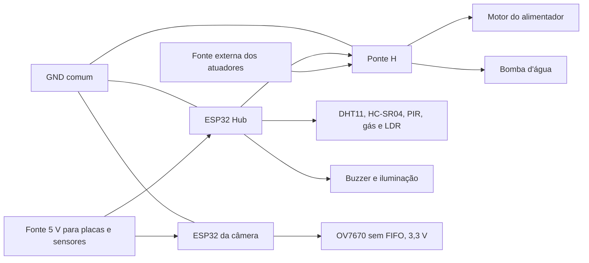

# Esquema elétrico completo

Este documento descreve as ligações do Pet Guardian IoT conforme a pinagem dos
firmwares versionados. O sistema usa duas ESP32 independentes: uma para sensores e
atuadores e outra dedicada à câmera OV7670 sem FIFO.

## Visão geral

> Nunca alimente motor ou bomba diretamente pela ESP32. Use uma fonte externa
> compatível, ponte H e GND compartilhado. A OV7670 deve trabalhar em 3,3 V.

## ESP32 Hub de sensores

| Módulo / sinal | GPIO ESP32 | Alimentação | Observação |
|---|---:|---|---|
| DHT11 DATA | 4 | 3,3 V ou 5 V | Use resistor pull-up de 10 kΩ se o módulo não possuir |
| HC-SR04 ração TRIG | 18 | 5 V | Recipiente com 10 cm de altura |
| HC-SR04 ração ECHO | 19 | 5 V | Passe por divisor resistivo para reduzir 5 V para 3,3 V |
| HC-SR04 água TRIG | 5 | 5 V | Recipiente com 14 cm de altura |
| HC-SR04 água ECHO | 17 | 5 V | Passe por divisor resistivo para reduzir 5 V para 3,3 V |
| PIR OUT | 27 | Conforme módulo | Saída digital de presença |
| Sensor de gás AO | 34 | Conforme módulo | Garanta no máximo 3,3 V na entrada |
| LDR AO | 35 | 3,3 V | Entrada analógica |
| Iluminação / sinal | 13 | Conforme driver | Acione carga por transistor/relé quando necessário |
| Buzzer | 32 | Conforme buzzer | Use transistor se a corrente exceder a do GPIO |
| Ponte H alimentador IN1 | 14 | Lógica | Direção do motor |
| Ponte H alimentador IN2 | 12 | Lógica | Direção do motor |
| Ponte H alimentador EN | 25 | Lógica/PWM | Habilitação do motor |
| Ponte H bomba IN3 | 26 | Lógica | Direção/acionamento da bomba |
| Ponte H bomba IN4 | 23 | Lógica | Direção/acionamento da bomba |
| Ponte H bomba EN | 33 | Lógica/PWM | Habilitação da bomba |

### Divisor de tensão dos HC-SR04

O ECHO do HC-SR04 normalmente fornece 5 V, acima do limite da ESP32. Em cada ECHO,
use um resistor de 1 kΩ entre ECHO e GPIO e um resistor de 2 kΩ entre GPIO e GND.

## ESP32 dedicada à OV7670 sem FIFO

| Sinal OV7670 | GPIO / ligação ESP32 |
|---|---:|
| SIOD / SDA | 21 |
| SIOC / SCL | 22 |
| VSYNC | 34 |
| HREF | 35 |
| XCLK | 32 |
| PCLK | 33 |
| D0 | 27 |
| D1 | 5 |
| D2 | 2 |
| D3 | 15 |
| D4 | 14 |
| D5 | 13 |
| D6 | 12 |
| D7 | 4 |
| RESET | 3,3 V |
| PWDN | GND |
| VCC | 3,3 V |
| GND | GND |

Mantenha os fios da câmera curtos e organizados. O barramento paralelo é sensível a
ruído, mau contato e alimentação instável.

## Alimentação recomendada

- ESP32s: USB ou fonte regulada adequada.
- Sensores: conforme a especificação de cada módulo.
- OV7670: somente 3,3 V.
- Motor e bomba: fonte externa dimensionada para a corrente de partida.
- Todas as fontes de lógica devem compartilhar GND.
- Adicione capacitor eletrolítico próximo à ponte H para reduzir quedas de tensão.

## Simulação Wokwi

O arquivo [`../wokwi/diagram.json`](../wokwi/diagram.json) representa as duas ESP32 e
as ligações da montagem. Como Wokwi não simula todos os módulos reais, a OV7670, a
ponte H, o motor, a bomba e o sensor de gás são abstraídos por analisadores lógicos
ou controles analógicos. Essa abstração não altera os firmwares nem a pinagem.

